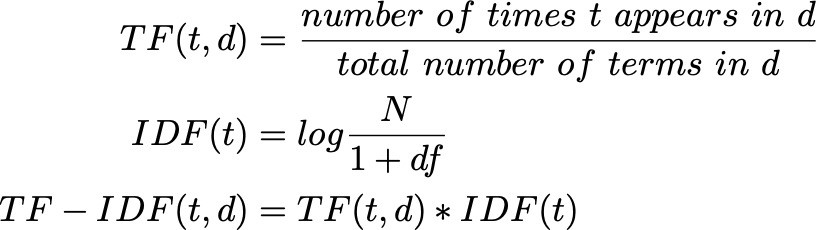

# SearchEngine

Implement Search Engine Performing Full Text Search using Java+MySQL

## Introduction

This projects purpose is to a as a simple search engine. The search engine will take input data from users and return the document id's after the search is done successfully.
Creating the right strategy for optimized research and also ability to store data.

# Overview 

## Application Purpose

This application will present a web application Search Engine.

# Technical stack and Implementations

## Building stack used

 1. MySQL instance using mysql v.8.1 using INNODB engine
 3. Java - JDK 11
 4. Maven - for dependency management/deployment
 5. Jakarta EE 8 JAX-RS for the web API
 6. Apache Glassfish v.6 -- application server
 7. Jquery library - AJAX for client request
 8. HTML5/CSS3 - client interface
 9. NodeJs v.14.16 - NPM 6.14.12

# Environment Preparation

## Back-end Environment

1 - Installation of mysqld and MySQL in local machine

2 -  Create new DB cluster using Xammp console

3 - Create Table document_id_tbl as data storage

4 - Create Index Table from document_id_tbl TERMS column to use for FULL TEXT INDEX functions

5 - Create connection with Java using mysql-connection-java dependency on POM.xml

6 - Install Jersey library for using REST Architecture

7 - Unit Testing using Junit5 Jupiter FrameWork

## Front-end Environment

1 - Run Client interface on NODE JS server.

2 - Create a static HTML+CSS interface

3 - Use Jquery library for async calls using AJAX 

## Application Schema 

# FULL TEXT INDEX benefits - Algorithm Formula

## How Relevancy Ranking is Calculated

InnoDB full-text search is modeled on the Sphinx full-text search engine, and the algorithms used are based on BM25 and TF-IDF ranking algorithms. For these reasons, relevancy rankings for InnoDB boolean full-text search may differ from MyISAM relevancy rankings.

InnoDB uses a variation of the “term frequency-inverse document frequency” (TF-IDF) weighting system to rank a document's relevance for a given full-text search query. The TF-IDF weighting is based on how frequently a word appears in a document, offset by how frequently the word appears in all documents in the collection. In other words, the more frequently a word appears in a document, and the less frequently the word appears in the document collection, the higher the document is ranked.

The term frequency (TF) value is the number of times that a word appears in a document. The inverse document frequency (IDF) value of a word is calculated using the following formula, where total_records is the number of records in the collection, and matching_records is the number of records that the search term appears in.
  
>    **${IDF} = log10( ${total_records} / ${matching_records} )**

When a document contains a word multiple times, the IDF value is multiplied by the TF value:

>    **${TF} * ${IDF}**

Using the TF and IDF values, the relevancy ranking for a document is calculated using this formula:

>    **${rank} = ${TF} * ${IDF} * ${IDF}**

# Test Cases and Examples

# Running the application

